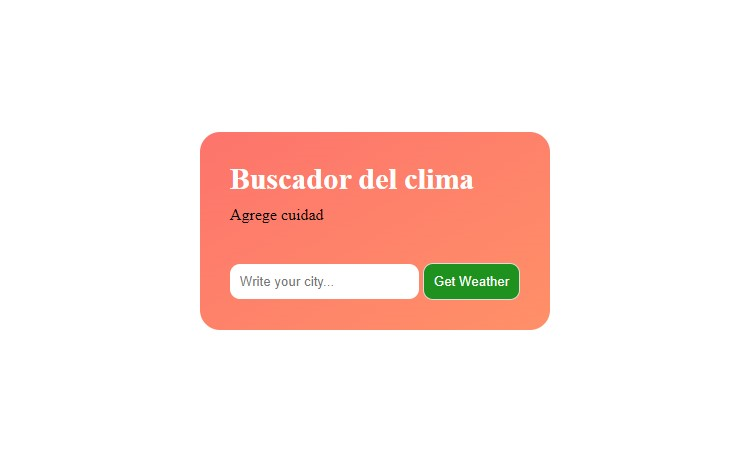
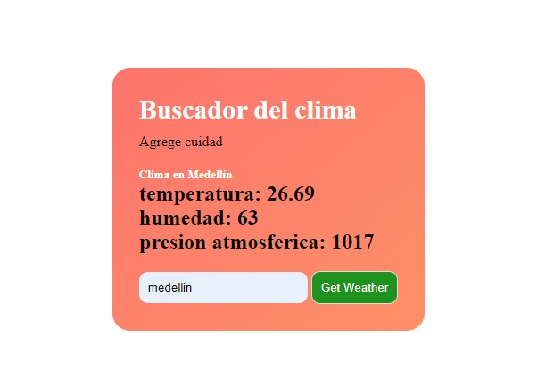

### Brayan Cordoba Y Deivy Patiño

### API de Clima

#### Descripción
La aplicación/API de clima ofrece información actualizada sobre el clima de diversas ciudades. Utiliza la API de OpenWeatherMap para obtener datos precisos de temperatura, humedad y presión atmosférica.

#### Arquitectura
La aplicación está desarrollada utilizando únicamente HTML, CSS y JavaScript. No requiere ninguna dependencia externa para su funcionamiento.

#### Comandos para Levantar la Aplicación
Para ejecutar la aplicación, simplemente abre el archivo `index.html` en un navegador web compatible.

#### Pantallazos de la Vista Final
Aquí se incluirían capturas de pantalla de la interfaz final de la aplicación/API de clima. 

